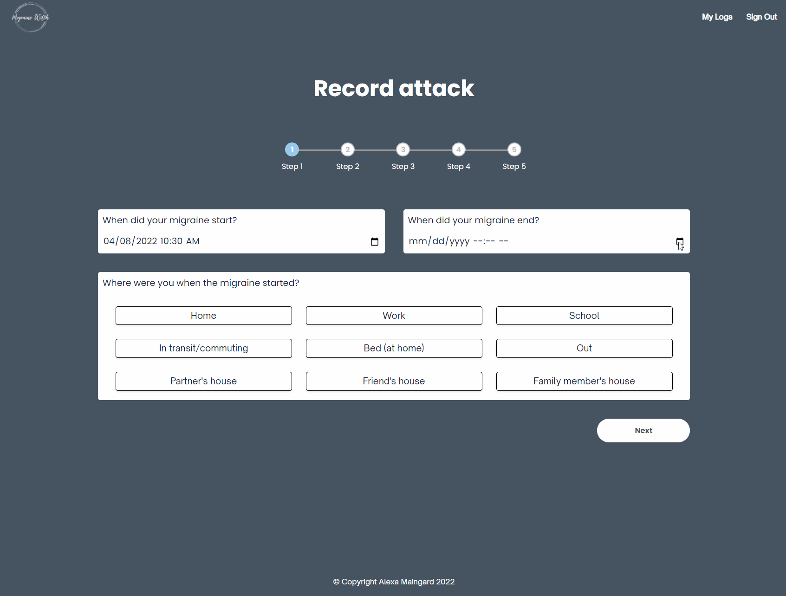
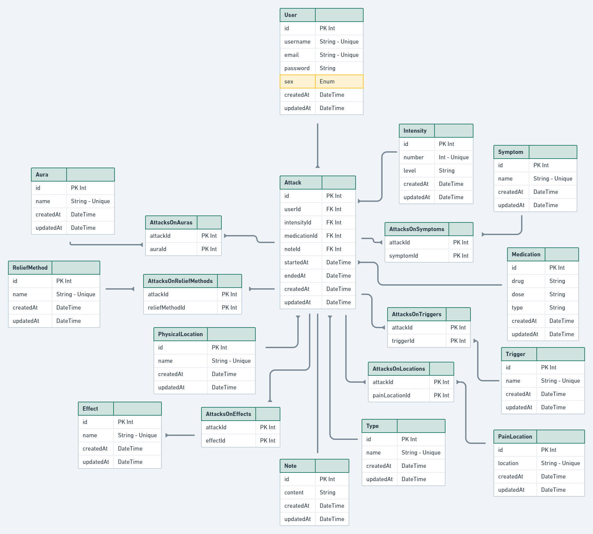

# Migraine Witch

Website App built in React/TypeScript using an Express server. Built in ≈ 9 days.

The main functionality of the app is to help you keep track of your migraine attacks.



## ERD



## How to Use

1. Create an .env file containing:
```
DATABASE_URL="yourDatabaseURL?schema=prisma"
SHADOW_DATABASE_URL="yourDatabaseURL?schema=shadow"

SECRET="yourSecretOfChoice"
```

1. Run `npm install`
2. Run `npm run build`
3. Run `npm start`